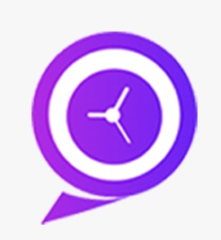

<div id="top"></div>
 
[](https://gitlab.rz.htw-berlin.de/softwareentwicklungsprojekt/sose2022/team9/-/blob/main/license.txt)


<a href="mailto:altarius1998@gmail.com?"></a>
<a href="mailto:elian.ariana98@hotmail.com?"></a>
<a href="mailto:s0571746@htw-berlin.de?"></a>


<!-- PROJECT LOGO -->
<br />
<div align="center">
  <a href="https://github.com/github_username/repo_name">
    
  </a>

<h3 align="center">Meet Me</h3>

  <p align="center">
    das ist ein App, die Terminabsprachen zwischen zwei oder mehreren Nutzern ermöglicht und vereinfacht.
    <br />
    <a href="https://gitlab.rz.htw-berlin.de/softwareentwicklungsprojekt/sose2022/team9/-/tree/main/"><strong>Docs Entdecken »</strong></a>
    <br />
    <br />
    <a href="https://gitlab.rz.htw-berlin.de/softwareentwicklungsprojekt/sose2022/team9/-/tree/main/Meet-Me-SW-Projekt">Demo Anzeigen</a>
    ·
    <a href="https://gitlab.rz.htw-berlin.de/softwareentwicklungsprojekt/sose2022/team9/-/issues/new">Bug Melden</a>
    ·
    <a href="https://gitlab.rz.htw-berlin.de/softwareentwicklungsprojekt/sose2022/team9/-/issues/new">Request Feature</a>
  </p>
</div>


<!-- TABLE OF CONTENTS -->
<details>
  <summary>Inhaltsverzeichnis</summary>
  <ol>
    <li>
      <a href="#über-das-projekt">Über das Projekt</a>
      <ul>
        <li><a href="#gebaut-mit">Gebaut mit</a></li>
      </ul>
    </li>
    <li>
      <a href="#einführung">Einführung</a>
      <ul>
        <li><a href="#prerequisites">Voraussetzungen</a></li>
        <li><a href="#installation">Installation</a></li>
      </ul>
    </li>
    <li><a href="#verwendungszweck">Verwendungszweck</a></li>
    <li><a href="#roadmap">Roadmap</a></li>
    <li><a href="#contributing">Mitwirkenden</a></li>
    <li><a href="#lizenz">Lizenz</a></li>
    <li><a href="#contact">Kontakt</a></li>
    <li><a href="#danksagung">Danksagung</a></li>
  </ol>
</details>


<!-- ABOUT THE PROJECT -->
## Über das Projekt

[![Product Name Screen Shot][product-screenshot]](https://example.com)

Diese Anwendung befindet sich noch in der Entwicklung und wird sowohl für iOS- als auch für Android-Smartphones verfügbar sein. Weitere Details finden Sie in den <a href="">technischen Spezifikationen</a>.

<p align="right">(<a href="#top">back to top</a>)</p>

### Verzeichnisse:
*<a href="https://gitlab.rz.htw-berlin.de/softwareentwicklungsprojekt/sose2022/team9/-/tree/main/Meet-Me-SW-Projekt">Meet-Me-SW-Projekt : </a>den Quellcode des Projekts

*<a href="https://gitlab.rz.htw-berlin.de/softwareentwicklungsprojekt/sose2022/team9/-/tree/main/Modellierung">Modellierung : </a>alle Informationen über unsere ER-Diagram, use-case Diagram und Komponenten Diagram


### Gebaut mit

* [Flutter](https://flutter.dev/)
* [FlutterFlow.io](https://flutterflow.io/)
* [Back4App](https://www.back4app.com/)


<p align="right">(<a href="#top">back to top</a>)</p>


<!-- GETTING STARTED -->
## Einführung

Hier sind die Schritte, die unternommen werden müssen, um die App auf Ihrem Computer kompilieren zu können:
### Flutter installieren

Klicken Sie auf diesen <a href="https://docs.flutter.dev/get-started/install/windows">Link</a>, um alle notwendigen Schritte zur Installation von Flutter auf Ihrem Computer anzuzeigen. 

<b>Hinweis :</b> Das Projekt wird mit einer älteren Version von Flutter (v2.10.5) entwickelt. Wenn Sie Fehler mit der neuesten Version von Flutter erhalten, versuchen Sie, eine ältere Version zu installieren.

### IDE auswählen

Sie sollten zuerst eine IDE auswählen, in der Sie die Anwendung kompilieren werden. + Wählen Sie einen Emulator, 
in dem Sie sie öffnen können
* Beisipele
  * [Android Studio](https://developer.android.com/)
  * [Visual Studio Code](https://visualstudio.microsoft.com/)

### Clone The Repository
1. Installieren Sie <a href="https://git-scm.com/downloads">Git</a> auf Ihrem Computer. 
2. Erstellen Sie ein lokales Verzeichnis, in dem Sie das Repository klonen möchten.
3. Öffnen Sie cmd und gehen Sie in dieses Verzeichnis
4. klonen Sie das Repository mit dieser Command line :
 ```sh
   git clone https://gitlab.rz.htw-berlin.de/softwareentwicklungsprojekt/sose2022/team9.git
   ```

### Flutter Dependency Installieren

1. Öffnen Sie die Datei pubspec.yaml, die sich im App-Ordner befindet, und fügen Sie den erforderlichen Paketnamen und die erforderlichen Versionen hinzu: unter Dependencies.
2. Dependency installieren
Führen Sie diesen Befehl vom Terminal aus:
 ```sh
   flutter pub get
   ```
<b>ODER</b>
Vom Android Studio/IntelliJ: Klicken Sie im Aktionsband oben in pubspec.yaml auf Packages get.
Vom VS Code: Klicken Sie auf Get Packages auf der rechten Seite des Aktionsmenübands oben in pubspec.yaml.

3. Dependency importieren .
   Fügen Sie eine entsprechende Importanweisung im Dart-Code hinzu. (Falls nicht vorhanden)
4. Flutter plugin herunterladen und installieren  
5. Stoppen Sie die App und starten Sie sie neu, falls erforderlich
IWenn das Paket plattformspezifischen Code enthält (Kotlin/Java für Android, Swift/Objective-C für iOS), muss dieser Code in Ihre App integriert werden. Hot Reload und Hot Restart aktualisieren nur den Dart-Code, sodass möglicherweise ein vollständiger Neustart der App erforderlich ist, um Fehler wie MissingPluginException bei der Verwendung des Packages zu vermeiden.

<b>Hinweis : </b> das Backend wird von back4app unterstützt. Die Back4App Parse API verbindet sich mit dem Backend unter Verwendung von REST-Architektur und JSON-Codierung. Der Zugriff auf die Datenbank wird vorerst nur den Mitwirkenden gewährt.

<p align="right">(<a href="#top">back to top</a>)</p>

### App Testen 

Um den App zu testen können Sie folgenede user credentials benutzen :<br>
               <b>Username :</b> Rayen<br>
               <b>Password :</b> azert741

<!-- USAGE EXAMPLES -->
## Verwendungszweck

Die App erleichtert das Organisieren von Treffen zwischen einer Gruppe von Personen. Stellen Sie sich vor, Sie möchten mit einigen Freunden ein Fußballspiel spielen, sodass Sie etwa 8 Personen über den Messenger kontaktieren müssen und hoffen, dass sie schnell antworten. Dies kann einen ganzen Tag dauern, um dies zu organisieren.Mit unserer App dauert dieser Vorgang nur wenige Sekunden. Sie müssen nur den Termin vereinbaren und die gewünschte Personen einladen.

_For more examples, please refer to the [Documentation](https://example.com)_

<p align="right">(<a href="#top">back to top</a>)</p>


<!-- ROADMAP -->
## Roadmap
 * <b>Sprint 1: 02/05/2022 - 29/05/2022 </b>
- [x] Aufgabe 1 : Datenbank für backend
- [x] Aufgabe 2 : GUI kann angezeigt werden
- [x] Aufgabe 3 : Gitlab kann benutzt werden
- [x] Aufgabe 4 : IDE funktioniert
- [x] Aufgabe 5 : Packages sind verstanden
                         <details>
                         <summary>vorhandene packages</summary>
                         -<a href="#top"> Flutter_chat_ui Package </a><br>
                         -<a href="#top"> table_calendar Package </a><br>
                         -<a href="#top"> Image_picker Package </a><br>
                         </details>
                      

 * <b>Sprint 2: 30/05/2022 - 19/06/2022 </b> 
 - [x] Aufgabe 1 : Freundschaftsanfragen mit QR-Code senden
 - [x] Aufgabe 2 : Meetings mit QR-Code senden
 - [x] Aufgabe 3 : CleanCode (Doku erzeugen)
 - [x] Aufgabe 4 : User-Emails werden überprüft
 * <b>Sprint 3: 20/06/2022 - 10/07/2022 </b>
 - [x] Aufgabe 1 : Kontakte können hingefügt werden
 - [x] Aufgabe 2 : Termine können angezeigt werden
 - [x] Aufgabe 3 : Bugs fixen

See the [open issues](https://gitlab.rz.htw-berlin.de/softwareentwicklungsprojekt/sose2022/team9/-/blob/main/Issue%20Tracking.xlsx) for a full list of proposed features (and known issues).


<p align="right">(<a href="#top">back to top</a>)</p>


<!-- CONTRIBUTING -->
## Mitwirken!

Beiträge machen die Open-Source-Community zu einem so großartigen Ort zum Lernen, Inspirieren und Schaffen. Alle Beiträge, die Sie leisten, werden **sehr geschätzt**.

Wenn Sie einen Vorschlag haben, der dies verbessern würde, forken Sie bitte das Repo und erstellen Sie eine Pull-Anfrage. Sie können auch einfach ein <a href="https://gitlab.rz.htw-berlin.de/softwareentwicklungsprojekt/sose2022/team9/-/issues/new">Issue</a> mit dem Stichwort "Verbesserung" eröffnen.
Vergiss nicht, dem Projekt einen Stern zu geben! Danke noch einmal!

1. Fork the Project
2. Create your Feature Branch (`git checkout -b feature/AmazingFeature`)
3. Commit your Changes (`git commit -m 'Add some AmazingFeature'`)
4. Push to the Branch (`git push origin feature/AmazingFeature`)
5. Open a Pull Request

<p align="right">(<a href="#top">back to top</a>)</p>


<!-- LICENSE -->
## Lizenz

Distributed under the MIT License. See `LICENSE.txt` for more information.

<p align="right">(<a href="#top">back to top</a>)</p>


<!-- CONTACT -->
## Contact

Rayen Bedoui - <a href= "">LinekdIn</a> - altarius1998@gmail.com

Elian Ariana - <a href= "">LinekdIn</a> - Elian.ariana98@hotmail.com

Maged Yakan  - <a href= "">LinekdIn</a> - s0571746@htw-berlin.de

Project Link: [https://github.com/github_username/repo_name](https://gitlab.rz.htw-berlin.de/softwareentwicklungsprojekt/sose2022/team9)

<p align="right">(<a href="#top">back to top</a>)</p>


<!-- ACKNOWLEDGMENTS -->
## Danksagung

* Herr Junger für die Anleitung
* Das Back4App-Dev Team für die Bereitstellung einer detaillierten Dokumentation und Anleitung zur Verwendung von back4app
* Flyer.chat Team (flutter_chat_ui) und aleksanderwozniak (table_Calendar Package) für die Bereitstellung dieser Pakete mit Dokumentation

<p align="right">(<a href="#top">back to top</a>)</p>


<!-- MARKDOWN LINKS & IMAGES -->
<!-- https://www.markdownguide.org/basic-syntax/#reference-style-links -->
[license-shield]: https://img.shields.io/github/license/github_username/Meetme.svg?style=for-the-badge
[license-url]: https://gitlab.rz.htw-berlin.de/softwareentwicklungsprojekt/sose2022/team9/-/blob/main/license.txt
[linkedin-shield]: https://img.shields.io/badge/-LinkedIn-black.svg?style=for-the-badge&logo=linkedin&colorB=555
[linkedin-url]: https://linkedin.com/in/linkedin_username
[product-screenshot]: images/name.png
